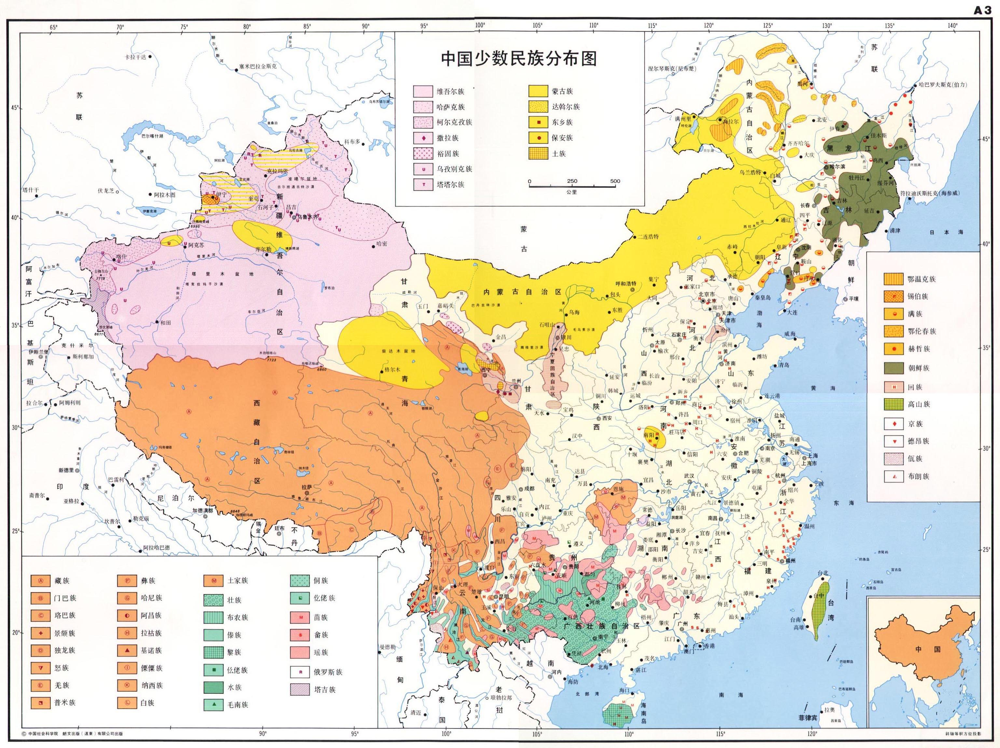

# 中国语言地图集

<!-- <o:LastAuthor>项梦冰</o:LastAuthor> -->

目   录

- [概览](#概览)
  - [A1 中国语言图](#a1-中国语言图)
  - [A2 中国汉语方言图](#a2-中国汉语方言图)
  - [A3 中国少数民族分布图](#a3-中国少数民族分布图)
  - [A4 中国少数民族语言分布图](#a4-中国少数民族语言分布图)
  - [A5 广西壮族自治区语言分布图](#a5-广西壮族自治区语言分布图)

- [方言明细](#方言明细)
  - [B1 官话之一](#b1-官话之一)
  - [B2 官话之二](#b2-官话之二)
  - [B3 官话之三](#b3-官话之三)
  - [B4 官话之四](#b4-官话之四)
  - [B5 官话之五](#b5-官话之五)
  - [B6 官话之六](#b6-官话之六)
  - [B7 晋语](#b7-晋语)
  - [B8 东南地区的汉语方言](#b8-东南地区的汉语方言)
  - [B9 吴语](#b9-吴语)
  - [B10 安徽南部汉语方言](#b10-安徽南部汉语方言)
  - [B11 江西省与湖南省的汉语方言](#b11-江西省与湖南省的汉语方言)
  - [B12 闽语](#b12-闽语)
  - [B13 广东省的汉语方言](#b13-广东省的汉语方言)
  - [B14 广西壮族自治区汉语方言](#b14-广西壮族自治区汉语方言)
  - [B15 客家话](#b15-客家话)
  - [B16  海外汉语方言](#b16-海外汉语方言)
    - [（a） 太平洋地区](#a-太平洋地区)
    - [（b）其他地区](#b其他地区)

- [少数民族语言](#少数民族语言)
  - [C1 中国北方少数民族语言图](#c1-中国北方少数民族语言图)
  - [C2 蒙古语族语言图](#c2-蒙古语族语言图)
  - [C3 蒙古语方言图](#c3-蒙古语方言图)
  - [C4 突厥语族语言图](#c4-突厥语族语言图)
  - [C5 满通古斯语族语言图](#c5-满通古斯语族语言图)
  - [C6 中国南方少数民族语言图](#c6-中国南方少数民族语言图)
  - [C7 壮侗语族语言图](#c7-壮侗语族语言图)
  - [C8 苗瑶语族语言图](#c8-苗瑶语族语言图)
  - [C9 苗语方言图](#c9-苗语方言图)
  - [C10 藏缅语族语言图](#c10-藏缅语族语言图)
  - [C11 藏语方言图](#c11-藏语方言图)
  - [C12 广西壮族自治区少数民族语言图](#c12-广西壮族自治区少数民族语言图)
  - [C13 云南省少数民族语言图](#c13-云南省少数民族语言图)
  - [C14 海南岛和台湾省少数民族语言图](#c14-海南岛和台湾省少数民族语言图)

> 

---

## 概览

### A1 中国语言图

### A2 中国汉语方言图

### A3 中国少数民族分布图

### A4 中国少数民族语言分布图

### A5 广西壮族自治区语言分布图

---

## 方言明细

### B1 官话之一

黑龙江省   吉林省   辽宁省   内蒙古自治区东部

### B2 官话之二

北京市   天津市   河北省   山东省西部

### B3 官话之三

河南   山东   皖北   苏北

### B4 官话之四

陕西省甘肃省青海省宁夏回族自治区

### B5 官话之五

新疆维吾尔自治区

### B6 官话之六

四川省   云南省   贵州省   广西壮族自治区   湖北省西部

### B7 晋语

山西省及其附近地区

### B8 东南地区的汉语方言

### B9 吴语

浙江   上海   苏南

### B10 安徽南部汉语方言

### B11 江西省与湖南省的汉语方言

### B12 闽语

福建   台湾   粤东   海南

### B13 广东省的汉语方言

### B14 广西壮族自治区汉语方言

### B15 客家话

### B16  海外汉语方言

#### （a） 太平洋地区

#### （b）其他地区

---

## 少数民族语言

### C1 中国北方少数民族语言图

### C2 蒙古语族语言图

### C3 蒙古语方言图

### C4 突厥语族语言图

### C5 满通古斯语族语言图

### C6 中国南方少数民族语言图

### C7 壮侗语族语言图

### C8 苗瑶语族语言图

### C9 苗语方言图

### C10 藏缅语族语言图

### C11 藏语方言图

### C12 广西壮族自治区少数民族语言图

### C13 云南省少数民族语言图

### C14 海南岛和台湾省少数民族语言图

